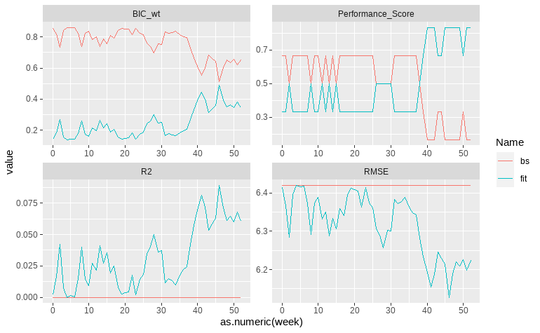
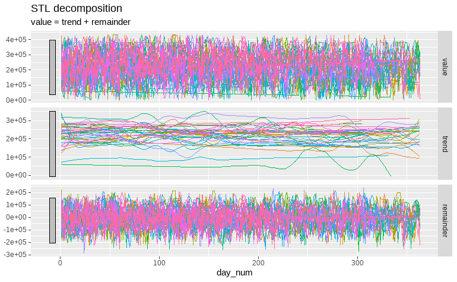

<!-----

You have some errors, warnings, or alerts. If you are using reckless mode, turn it off to see inline alerts.
* ERRORs: 0
* WARNINGs: 0
* ALERTS: 3

Conversion time: 1.259 seconds.

Using this Markdown file:

1. Paste this output into your source file.
2. See the notes and action items below regarding this conversion run.
3. Check the rendered output (headings, lists, code blocks, tables) for proper
   formatting and use a linkchecker before you publish this page.

Conversion notes:

* Docs to Markdown version 1.0β34
* Mon Apr 03 2023 06:13:02 GMT-0700 (PDT)
* Source doc: Filtering participants
* Tables are currently converted to HTML tables.
* This document has images: check for >>>>>  gd2md-html alert:  inline image link in generated source and store images to your server. NOTE: Images in exported zip file from Google Docs may not appear in  the same order as they do in your doc. Please check the images!

----->

>>>>>  gd2md-html alert:  ERRORs: 0; WARNINGs: 0; ALERTS: 3.

<ul style="color: red; font-weight: bold"><li>See top comment block for details on ERRORs and WARNINGs. <li>In the converted Markdown or HTML, search for inline alerts that start with >>>>>  gd2md-html alert:  for specific instances that need correction.</ul>

Links to alert messages:
<a href="#gdcalert1">alert1</a>
<a href="#gdcalert2">alert2</a>
<a href="#gdcalert3">alert3</a>

>>>>> PLEASE check and correct alert issues and delete this message and the inline alerts.

# Predicting PD progression using smartwatch data.

## Abstract

We tried to predict Parkinson's Disease progression using smartwatch data collected by the Parkinson’s Progressive Markers Initiative (PPMI) sponsored by the Michael J. Fox Foundation. We performed a compliance analysis to understand daily use patterns of the participants, and then we moved on to predict the MDS-UPDRS score using the biometric data collected by the Verily smartwatch. Despite the model being slightly better than the baseline in terms of RMSE (RMSEdelta=0.04) and Bayesian Information Criteria (BIC) or overall performance (Rank score = 0.83), these differences were not statistically significant (p > 0.05). We suggest that 1 years ± 2 months of data are not enough to predict the change in the MDS-UPDRS score.

## Results 

### Compliance in the Verily Study Watch experiment

Our experimental cohort consisted of individuals who used the Verily Study Watch for an average of 466.81 ± 191.34 days (range=5-771.49), with a reported daily usage of 79% ± 23% (range=0-1). Participants attended a median of three visits or clinically relevant events, including remote visits or unscheduled contacts. The number of recorded events ranged from 1 to 5, with an interquartile range of 1.02. On average, the clinically relevant events covered 507.69 ± 177.84 days. We found no significant differences in the duration of the study (𝛘2 =0.74, df = 2, p-value = 0.69) or completion rate (fig.1A, 𝛘2=0.2, df = 2, p-value(log-rank) = 0.83) between PD, HC, and prodromal participants, indicating that clinical status did not affect adherence to the Verily Study Watch. This remained true even if we removed individuals who participated in the study for less than 100 days (𝛘2 =0.99, df = 2, p-value =0.61) or if we took into account the stratification in genetic and sporadic subgroups in PD individuals (W = 2526, p-value = 0.82).

We then examined whether demographic factors (fig.1D) and clinical variables representing disease severity (supplementary results 1) affected participants' adherence to the Verily Study Watch experiment. Our results showed that neither demographic factors (𝛘2= 9.92, df = 2,  p-value(Log-Rank) = 0.07) nor clinical variables had a significant impact on the duration of the study.

We also tested the hypothesis that daily usage of the Verily Study Watch was influenced by the same set of demographic and clinical variables, including clinical status (Daily usage: 𝛘2 =0.41, df = 2, p-value = 0.81) (fig.1B). The same hypothesis was tested on weekly usage data of the smartwatch (𝛘2 = 0.9168, df = 2, p-value = 0.6323) (fig.1C). All tests reported negative results except for the age at start (rpearson = 0.26, p-value &lt; 0.01), indicating that the smartwatch usage was only partially affected by these factors. These results are summarized in the supplementary results 3. 

>>>>>  gd2md-html alert: inline image link here (to images/image1.png). Store image on your image server and adjust path/filename/extension if necessary.  (<a href="#">Back to top</a>)(<a href="#gdcalert2">Next alert</a>) >>>>> 

Fig.1 Summary of the compliance analysis. A) Kaplan-Meier plot illustrating the completion rate (CR) of the study for each Strata. At 1 year (52 weeks) CR was estimated at 0.53, 0.62 0.66 for HC, PD and Prodromal individuals. B) Box plot illustrating the average daily use for each strata. After the Kruskal Wallis we used the Wilcoxon rank sum test with continuity correction to generate the post hoc p-values. C) The average percentages of weekly use in approximately 1 year of the experiment (≈52 weeks). D) A forest plot representing the Cox Proportional Hazards Model that was used to test the hypothesis that clinical status and demographic features may influence the duration of the study. 

### Predicting PD progression with watch data

A set of 17 predictors was used to predict the UPDRS slope between the first and the last visits in a year. To remove redundant predictors, we used the automated model selection and multimodel inference with (G)LMs framework via genetic algorithm. The algorithm was trained to minimize the small-sample corrected AIC (AICC) and converged on roughly 740 generations, reporting that the best model included only the intercept and the total rem sleep time (AICC= 253.499, AICCmean = 259.104). We used the select model to test at which week UPDRS total change can be predicted. The model achieved a better overall performance than the baseline with only the intercept at week 40, roughly 84 days before the change in UPDRS score was certified by physicians  (BIC_wt = 0.34, Performance_Score = 0.83) (fig.2). Despite these results, the final model failed to reach a reasonable coefficient of determination, with the max R2  = 0.08 and RMSE difference of only 0.4 points from baseline (fig.2, 2 row).

>>>>>  gd2md-html alert: inline image link here (to images/image2.png). Store image on your image server and adjust path/filename/extension if necessary.  (<a href="#">Back to top</a>)(<a href="#gdcalert3">Next alert</a>) >>>>> 

Fig.2 Performance of the final model (fit) against the baseline (bs).

These results may be explained by time influence on the UPDRS total score. While, the correlation between changes in REM sleep and UPDRS score is moderate ( ⍴ = 0.45), inspecting the STL decomposed time series of the REM sleep data demonstrates that is almost constant. This means that no significant changes or trends are visible during the first year of the experiment (fig.3). 

>>>>>  gd2md-html alert: inline image link here (to images/image3.png). Store image on your image server and adjust path/filename/extension if necessary.  (<a href="#">Back to top</a>)(<a href="#gdcalert4">Next alert</a>) >>>>> 

Fig.3 STL decomposition on additive model covering the REM sleep time over an year for each participant. No clear trend was found while a large component of noise can be appreciated in the remainder tab.

## Methods

### Participants

We identified 354 participants that joined the study watch. Our first step was to identify the individuals with records for each metric measured by the smartwatch. We identified 342 out of 354 participants that had at least one observation in each of the verily database pages.

Out of these 342 PPMI participants that joined the Verily study, 10 belonged to the Early Imaging cohort, 2 were non-PD, non-Prodromal, non-HC (participants to be excluded), 2 participants belonged to the SWEDD legacy cohort. Furthermore, we identified 2 PD patients that were initially enrolled in the PD cohort but were reassigned to the Prodromal cohort. After careful consideration, participants in these categories (n=16) were excluded from the experiment according to the analytic dataset provided by the consensus committee (2022). 

The PD cohort included 61 individuals belonging to the genetic (nCONGBA=26, nCONLRRK2=35) subgroup, while 81 were enrolled in the sporadic subgroup. The prodromal cohort was composed of individuals enrolled in the genetic subgroup (n=138), Hyposmia (n=10) and RBD (2) subgroups. In the genetic subgroup, 3 prodromal individuals were diagnosed as CONGBA and CONLRRK2, yielding 84 and 57 individuals respectively in each sub-cohort. Out of the 150 Prodromal subjects, 143 did not convert to PD while 7 converted (ngenetic=1, nhyposmia= 4, nRBD=2). Phenotype conversion to PD was observed before the verily study watch (mean = 1.36 ± 1.46 years, range:0-3.5) and these participants were considered PD in the downstream analyses. Thus the experimental cohort (n=326) was composed of 34 healthy controls, 149 individuals affected by Parkinson's Disease, and 143 subjects labeled as prodromal.

### Demographics

Our study cohort included healthy controls (F=15, M=19), Parkinson’s disease (F=59, M=90) and prodromal (F=91, M=52) participants. The mean age at the start of the Verily study watch for the healthy controls was 66.33 ± 12.34 years (range: 39.15-87.36), while  prodromal individuals were 64.36 ± 7.17 years old on average (range: 46.63-87.72) and PD individuals were 68.16 ±  8.12 years old (range: 43.77-91.9). The individuals in the PD subcohort had 6.53 ± 2.05 years of PD duration, with Hoehn and Yahr staging from normal (n=1) and mild (n=126) to moderate (n=7) and severe (n=1) in PD medication ON state and normal (n=1) and mild (n=85) to moderate (n=15) and severe (n=2) in PD medication OFF state. 148 out of 149 PD participants in our experimental cohort were treated for PD at the start of the verily study watch experiment. Additional characteristics of the sample are shown in Table 1.

<table>
  <tr>
   <td colspan="6" >Table 1 - Additional Characteristics of the PD sample
   </td>
  </tr>
  <tr>
   <td>
   </td>
   <td>Mean
   </td>
   <td>SD
   </td>
   <td>Median
   </td>
   <td>95% CI
   </td>
   <td>Range
   </td>
  </tr>
  <tr>
   <td>Age at PD onset(years)
   </td>
   <td>59.7
   </td>
   <td>9.16
   </td>
   <td>60.25
   </td>
   <td>58.18-61.22
   </td>
   <td>19.6-83.06
   </td>
  </tr>
  <tr>
   <td>Duration of treatment
   </td>
   <td>4.07
   </td>
   <td>1.46
   </td>
   <td>4.58
   </td>
   <td>3.80-4.32
   </td>
   <td>0-4.58
   </td>
  </tr>
  <tr>
   <td>Education(years)
   </td>
   <td>16.7
   </td>
   <td>2.93
   </td>
   <td>16
   </td>
   <td>16.26-17.13
   </td>
   <td>12-27
   </td>
  </tr>
  <tr>
   <td>Levodopa equivalent Daily Dose
   </td>
   <td>455.05
   </td>
   <td>409.73
   </td>
   <td>320
   </td>
   <td>382.51-527.58
   </td>
   <td>20-2730
   </td>
  </tr>
</table>

All the features reported in table 1 were measured at the first clinical event corresponding to the start of the verily study watch. SD: standard deviation. 95% CI: confidence interval 95%. PD: Parkinson's disease. Range:minimum-maximum value.

### PD severity and progression

The Unified Parkinson's Disease Rating (UPDRS) and the Schwab and England Activities of Daily Living (ADL) scores at the start of the study watch are reported in table 2. ADL is a means of measuring a person’s ability to perform daily activities in terms of speed and independence. UPDRS combines elements of several scales to produce a comprehensive and flexible tool to monitor the course of Parkinson’s and the degree of disability.

Moreover, we calculated the estimates of clinically important differences (CIDs) for the UPDRS total score, which included minimal, moderate, and large thresholds. CIDs represent the minimum amount of change on a measure that patients can recognize and value, and were estimated using UPDRS total scores from the first and last PPMI clinical event in the verily study watch for each patient, based on the thresholds provided by Shulman et al. (2010). A minimal CID is 4.1 to 4.5 change on the UPDRS total score. A moderate CID was 8.5 to 10.3 on the UPDRS total score. A large CID was 16.4 to 17.8 on the UPDRS total score. We identified 66 patients that reported CIDs during the Verily study with varying intensities: minimal (n=17), to moderate (n=24), and large (n=25). The CIDs take place on average in 1.31 ± 0.56 years (median =1.1, range: 0.2-3.2). Of the 133 PD participants that had ADL data available at the start of the verily study watch, 64 were evaluated as completely independent in most daily activities (range: 75% to 100% ADL score), while 69 reported an increasing burden of the disease, with some dependency and mounting difficulties in daily activities (range: 50% to 75% ADL score). 

<table>
  <tr>
   <td colspan="6" >Table 2 - PD Severity during the verily study watch
   </td>
  </tr>
  <tr>
   <td>
   </td>
   <td>Mean
   </td>
   <td>SD
   </td>
   <td>Median
   </td>
   <td>95% CI
   </td>
   <td>Range
   </td>
  </tr>
  <tr>
   <td>MDS-UPDRS 1
   </td>
   <td>10.81
   </td>
   <td>5.18
   </td>
   <td>10
   </td>
   <td>9.92-11.69
   </td>
   <td>0-26
   </td>
  </tr>
  <tr>
   <td>MDS-UPDRS 2
   </td>
   <td>11.41
   </td>
   <td>6.16
   </td>
   <td>11
   </td>
   <td>10.36-12.43
   </td>
   <td>1-27
   </td>
  </tr>
  <tr>
   <td>MDS-UPDRS 3
   </td>
   <td>24.21
   </td>
   <td>11.05
   </td>
   <td>23
   </td>
   <td>22.33-26.1
   </td>
   <td>3-50
   </td>
  </tr>
  <tr>
   <td>MDS-UPDRS 4
   </td>
   <td>3.15
   </td>
   <td>3.02
   </td>
   <td>3
   </td>
   <td>2.64-3.67
   </td>
   <td>0-12
   </td>
  </tr>
  <tr>
   <td>UPDRS TOT
   </td>
   <td>49.58
   </td>
   <td>17.91
   </td>
   <td>49.5
   </td>
   <td>46.53-52.65
   </td>
   <td>13-90
   </td>
  </tr>
  <tr>
   <td>ADL
   </td>
   <td>84.29
   </td>
   <td>10.34
   </td>
   <td>80
   </td>
   <td>82.52-86.06
   </td>
   <td>50-100
   </td>
  </tr>
</table>

All the features reported in table 2 were measured at the first clinical event corresponding to the start of the verily study watch. SD: standard deviation. 95% CI: confidence interval 95%. PD: Parkinson's disease. Range:minimum-maximum value. MDS-UPDRS: Movement Disorder Society Unified Parkinson's Disease Rating, ADL: Schwab and England Activities of Daily Living (ADL).

### Compliance analysis

To conduct an analysis of the compliance to the Verily study watch experiment we derived the daily and weekly usage from each subject, then we computed the duration of the study in days, months and years using the epoch time reported in the data for each record. We identified the nearest clinical event for each smartwatch record by minimizing the difference between the age in seconds at each smartwatch record and the age at clinical visit, as indicated in the Verily Study Watch methods. 

In order to assess the study's dropout rate and completion rate, we computed the proportion of participants who dropped out each week, as well as the completion rate (1 - dropout rate). To maintain a meaningful number of individuals in the downstream analysis, we selected the participants that reported a mean daily usage of the Verily Study Watch equal to 80% for approximately 1 year (52 weeks) (fig.1C), corresponding to a completion rate with a span of 50% to 75% per group (fig.1A). Prior to hypothesis testing, we tested variables for normality and heteroskedasticity using Shapiro-Wilk and Levene tests, respectively. Then we employed Kruskal-Wallis tests with Wilcoxon rank sums tests with continuity correction as post-hoc to examine whether clinical status influenced the duration of the experiment. We utilized the same approach to investigate differences in daily use patterns based on clinical status. To analyze weekly differences in the usage of the Verily study watch, we used a Linear Mixed Model (LMM), with clinical status, time, and the interaction between clinical status and time as fixed effects, and participant ID as a random effect. After fitting the LMM, we generated p-values for fixed effects and interactions using the Wald Chi-square test. 

A Kaplan-Meir plot with a Log-Rank test was used to conduct a survival analysis. In particular, we investigated whether the clinical status was affecting the completion rate of the study over time. Finally, we employed a Cox proportional hazards model to assess whether dropout risk was influenced by clinical status and demographics, including age, sex, and years of education. We estimated hazard ratios and their confidence intervals to quantify the magnitude and direction of these effects. 

All statistical analyses were performed with a significance level of ɑ = 0.05. In order to control for the possibility of false positives, we applied the False Discovery Rate correction when appropriate. 

### Verily Study Watch data processing

The Verily Study Watch collected data on participants’ sleep patterns, including sleep staging (xxx), total time in bed, awake and sleep hours. Health related data, such as pulse rate and xxx and daily physical activity indicators, namely step counts were also included.  Raw data were preprocessed using the algorithms developed by the Verily data science units as indicated in the PPMI methods and in the following papers. As reported in the compliance analysis methods and results, we filtered the data to cover approximately 1 year (≈52 weeks) of smartwatch usage with average daily use = 79% ± 23% for each participant. Then we proceeded to aggregate the data in daily measurement. Step counts and in bed time were summed up on a daily basis, while the other variables, which were provided as hourly means, were reshaped into daily means or weighted means, where the weights are the number of measurements in each hour. The missing values in these time series were then imputed by spline interpolation and outliers were capped to the 0.25 and 0.75 centile. Finally, we performed Seasonal and Trend decomposition using Loess (STL) using the additive model to obtain the trend data corrected by the weekly seasonality.

### Modeling

We tested if the slope of each predictor, representing the amount of change in a year, predicted the change in UPDRS total score. To do so, we computed the slope of our predictors starting from the first week of the experiment. On this dataset, we fitted an empty GLM model as baseline, and another GLM with the predictors extracted from the automated model selection and multimodel inference with (G)LMs framework via genetic algorithm. At the end we collected the performance metrics (BIC, RMSE, LRT, R2), added to the original dataset the data from week 2 and repeated this loop until the last dataset contained all the data for that year. At each step we collected and aggregated metrics from baseline and the actual fit to compare them successively. All the analyses were performed in R.
